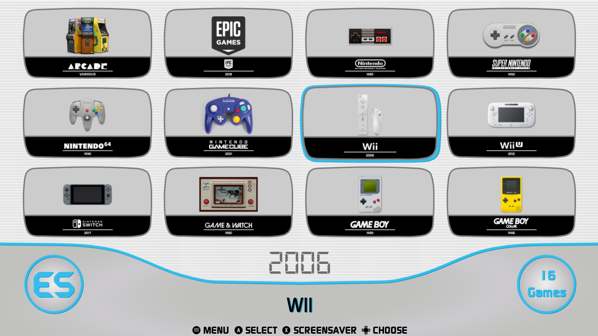
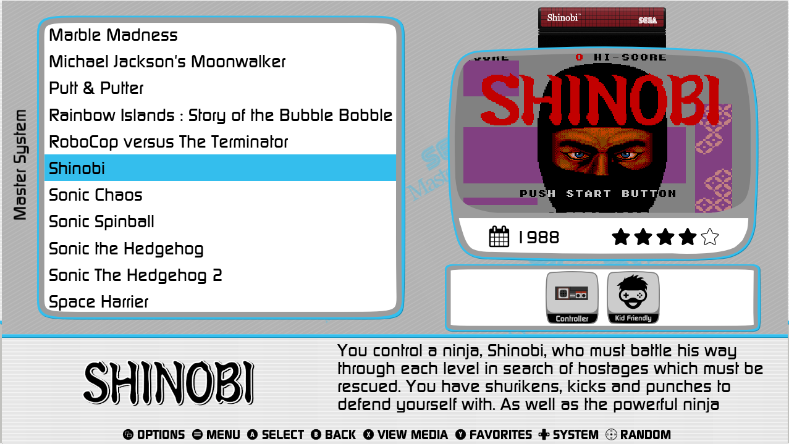
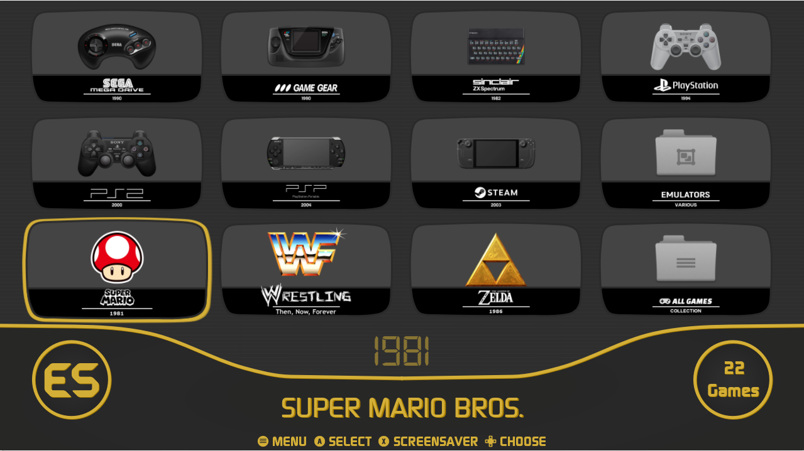
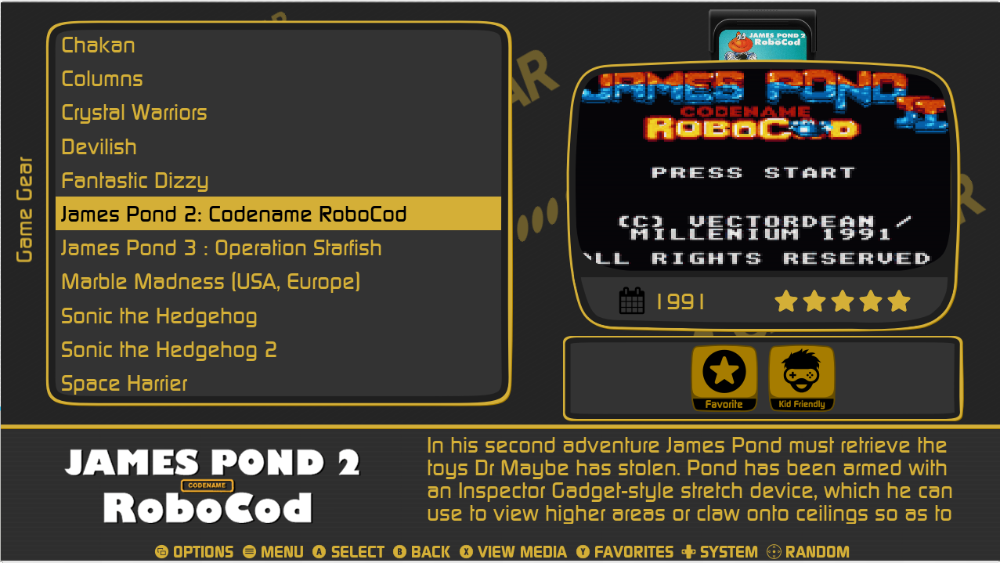
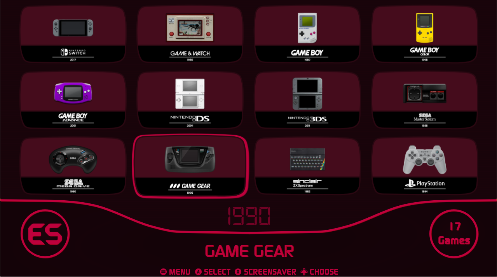
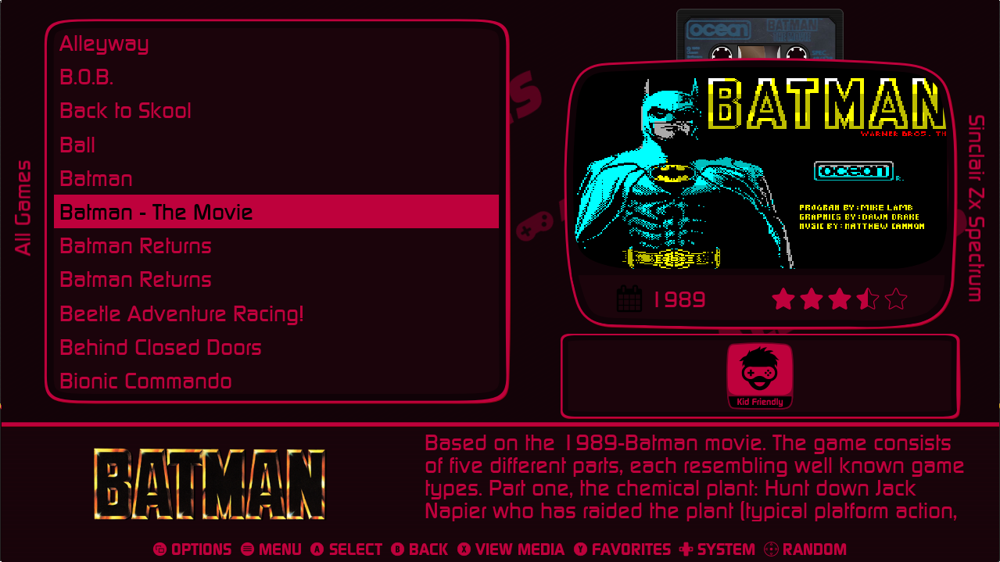
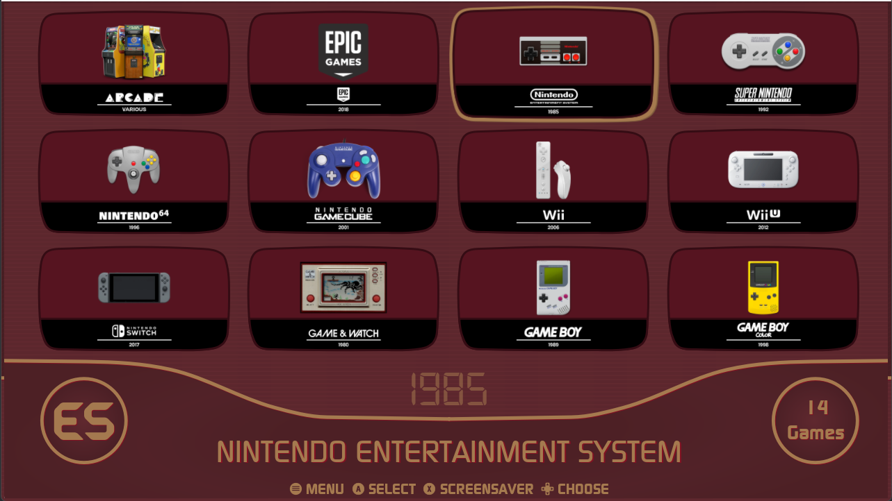
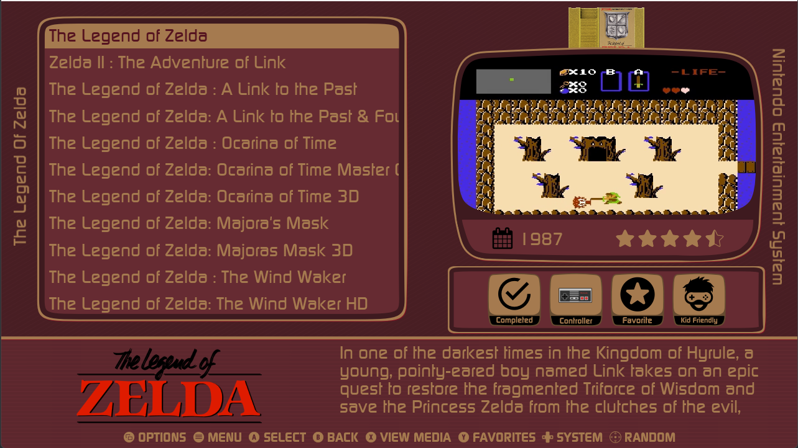

# ES-DWEE for ES-DE (es-dewee-es-de)

Inspired by the UI of the most versatile game consoles ever.

5 color schemes:

- Blue

- Gold

- Rose

- Famiwii

- Retro

2 font sizes:

- Medium
- Large

5 aspect ratios:

- 16:9
- 16:10
- 4:3
- 21:9
- 19.5:9

2 transitions:

- Instant
- Slide

